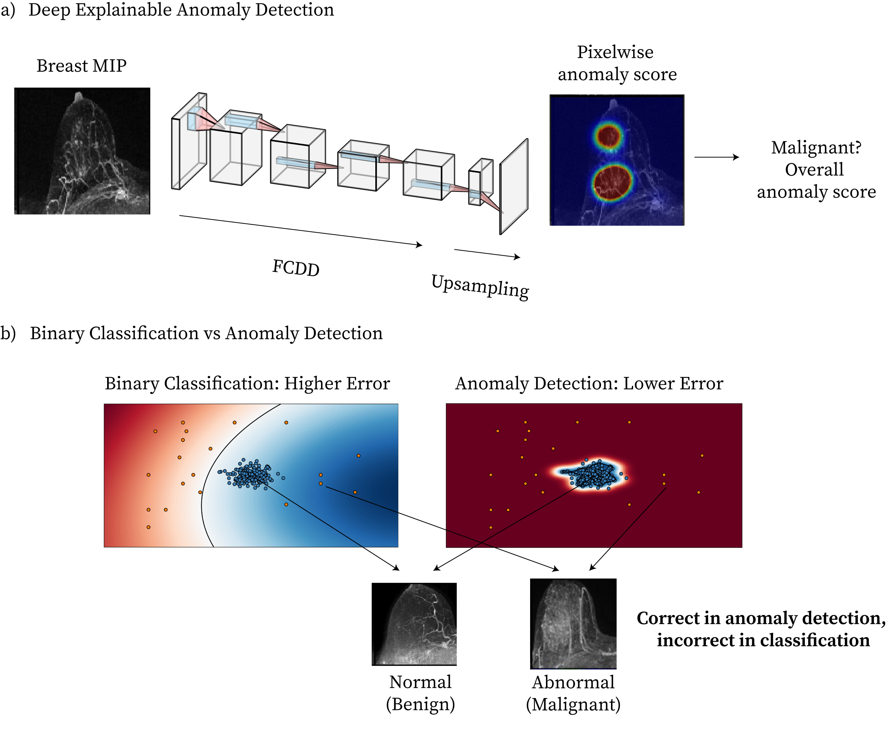

# FCDD - Explainable Anomaly Detection for Breast MRI Cancer Screening

This is an implementation of the models described in **"Cancer detection in breast MRI screening via explainable artificial intelligence anomaly detection"**.

FCDD enables both high-performance anomaly detection and anomaly explanations in the form of heatmaps, with emphasis on extreme class imbalance. The original FCDD implementation is available [here](https://github.com/liznerski/fcdd).



## 📚 Table of Contents

- [📄 Citation](#-citation)
- [📦 Installation](#-installation)
- [📁 Dataset Structure](#-dataset-structure)
- [🧪 Usage](#-usage)
- [🏃 Training Examples](#-training-examples)
- [🔬 Explanation of Log Data after Training](#-explanation-of-log-data-after-training)
- [💻 Quick Demo: Predictions and Anomaly Heatmaps](#-quick-demo-predictions-and-anomaly-heatmaps)
- [Disclaimer / Notices](#disclaimer--notices)

## 📄 Citation

If you use this code in your research, please cite our paper:

```
@article{oviedo2025cancer,
title={Cancer detection in breast MRI screening via explainable artificial intelligence anomaly detection},
author={Felipe Oviedo, Anum S. Kazerouni, Philipp Liznerski, Yixi Xu, Michael Hirano, Robert A. Vandermeulen, Marius Kloft, Elyse Blum, Adam M Alessio, Christopher I. Li, William B Weeks, Rahul Dodhia, Juan Lavista Ferres, Habib Rahbar, Savannah C. Partridge},
journal={Radiology},
year={2025},
publisher={Radiological Society of North America}
}
```

## 📦 Installation

We recommend a Conda-first setup for pytorch. This avoids ABI mismatches like operator torchvision::nms does not exist.

Files used here live in python/ folder: python/environment.yml (GPU); python/environment-cpu.yml (CPU); python/requirements.txt (core-only)

To install FCDD, run the following commands:

    cd python 
    # Choose one (GPU / CPU)
    conda env create -f environment.yml # creates with name "fcdd" change if needed
    # conda env create -f environment-cpu.yml
    conda activate fcdd
    pip install -r requirements.txt
    pip install -e . --no-deps

After installation, check that CUDA is detected by PyTorch:

    python -c "import torch; print(torch.cuda.is_available())"

## 📁 Dataset Structure

Organize your data directory as follows (relative to your chosen `datadir`, default: `../../data/MIP/`):

```
datadir/
  custom/
    train/           
      breast_img/             
        normal/              
          img1.tiff
          img2.tiff
          ...
        anomalous/   # (optional, for semi-supervised)
          imgX.tiff
    test/
      breast_img/
        normal/
          imgA.tiff
          ...
        anomalous/
          imgB.tiff
          ...
```

`normal` is the majority class, in this case the non-cancerous breast images. `anomalous` is the minority class, in this case the cancerous breast images.

In the case of the test set, the ground truth labels are inferred from folder structure. If there are no ground truth labels, samples to predict can be place in the `normal` folder. In inference, the model expects also the `train` folder with at least one image in the `normal` and `anomalous` folders, use a placeholder image if necessary. This does not affect the predictions, but is required for the model to run.

## 🧪 Usage

These are general usage instructions. For a complete example, see the [💻 Quick Demo: Predictions and Anomaly Heatmaps](#-quick-demo-predictions-and-anomaly-heatmaps) section.

To train a model, run the following commands:

    conda activate fcdd
    cd python/fcdd
    python runners/run_custom.py --supervise-mode other

- `--datadir`: Path to your dataset (default: `../../data/MIP/`)
- `--supervise-mode other`: Enables use of any available training anomalies

For semi-supervised training (as proposed in the paper), place anomalous breast images or cancer cases in the `train/breast_img/anomalous/` folder.

You can customize training parameters such as network architecture, loss, epochs, batch size, and more. For all options:

    python runners/run_custom.py --help

To perform inference, run:

    python runners/predict_custom.py --model model_name

**Arguments**
- `--model`: Specifies the model type to use for prediction. Options are:
  - `fcdd`: Fully Convolutional Data Description model.
  - `bce`: Binary Cross-Entropy model.
  - `hsc`: Hybrid Supervised Clustering model.
  - `fcdd_ref`: Reference-based FCDD model.
  Default: `fcdd`. Modify if your model has a different name.

- `--task`: Task number to run predictions for. Options are:
  - `1`: Task 1. Models validated on balanced detection (similar proportions of normal and anomalous cases). Not relevant unless using public checkpoints.
  - `2`: Task 2. Models validated on imbalanced detection (many more normal cases than anomalous cases). Not relevant unless using public checkpoints.
  Default: `1`.

- `--snapshot_path`: Path to the directory containing the model snapshot. If not provided, a default path is used based on the selected model and task. Directory should have a config.txt file with model arguments and a snapshot.pt file with the model weights.

- `--output_dir`: Directory to save the prediction results. If not specified, results are saved to a default directory under `../../data/results`.

- `--device`: GPU device number to use for inference. Default: `0`.

**Inference Output:**
- `predictions_results.json`: Model predictions, scores, labels, and metrics (ROC AUC, PR AUC)
- Heatmap images: Anomaly heatmaps for each test image, saved in the output directory.

File paths are automatically mapped to handle any reordering during data processing.

## 🏃 Training Examples
<details>
<summary>Click to expand</summary>

Suppose there are two dataset splits:
- Task 1 (Balanced detection - Similar proportions of normal and anomalous cases): `../../data/fccd_data_patient_task0_cv_0`
- Task 2 (Imbalanced detection - Many more normal cases than anomalous cases): `../../data/fccd_data_patient_kc_both_cv_0`

Training can be done by running the following commands (from `./python/fcdd`):

**FCDD:**

    python runners/run_custom.py --supervise-mode other --datadir ../../data/MIP/fccd_data_patient_task0_cv_0 --net FCDD_CNN224_VGG_NOPT --workers 4 --it 1 --epochs 1 --batch-size 32 --blur-heatmaps --objective fcdd --logdir-suffix task0_fcdd --gpu 0


**BCE (Binary Cross Entropy) baseline:**

    python runners/run_custom.py --supervise-mode other --datadir ../../data/MIP/fccd_data_patient_task0_cv_0 --net VGG_BCE_CROP --workers 6 --it 5 --epochs 200 --batch-size 32 --blur-heatmaps --objective bce --logdir-suffix task0_bce --gpu 0


**HSC (Hypersphere Classification):**

    python runners/run_custom.py --supervise-mode other --datadir ../../data/MIP/fccd_data_patient_task0_cv_0 --net CNN224_CROP --workers 6 --it 5 --epochs 200 --batch-size 32 --blur-heatmaps --objective hsc --logdir-suffix task0_hsc --gpu 0


**FCDD Symmetric (with reference images):**

This variant of FCDD calibrate the normal class by using a reference image for each MIP during training and inference. When possible, the reference is the contralateral breast (assumed benign) of the same patient; otherwise, a random benign image from another patient is used without data leakage.

Reference mappings are defined in: `train_ref.csv` — for training pairs and `test_ref.csv` — for evaluation pairs
Each file contains rows with columns `Actual` (path to the MIP), `Label` (0 normal, 1 anomalous), `Reference` (path to the reference MIP).


    python runners/run_scans_refs.py --datadir ../../data/MIP/fccd_data_patient_task0_cv_0 --net FCDD_REF_CNN224_VGG_NOPT --workers 6 --it 5 --epochs 200 --batch-size 32 --blur-heatmaps --objective fcddrefs --logdir-suffix task0_fcdd_ref --gpu 0

</details>

## 🔬 Explanation of Log Data after Training

<details>
<summary>Click to expand</summary>

After training, results (scores, metrics, plots, snapshots, and heatmaps) are stored in a log directory (default: `f"../data/results/{logdir_suffix}/"`). Each log directory contains subfolders for each trained class (`breast_img`), and within those, subfolders for each random seed (`it_X`). Each seed folder contains:
- `config.txt`: Training arguments
- `ds_preview.png`: Dataset preview
- `err.pdf`, `err_anomalous.pdf`, `err_normal.pdf`: Loss plots
- `heatmaps_paper_*`: Test heatmaps and ground-truths
- `heatmaps_global.png`, `train_heatmaps_global.png`: Heatmap visualizations
- `history.json`: Metrics
- `roc_curve.pdf`, `gtmap_roc_curve.pdf`: ROC curves
- `snapshot.pt`: Model checkpoint
- `src.tar.gz`: Training source code snapshot
- `tims/`: Raw tensor heatmaps

</details>

## 💻 Quick Demo: Predictions and Anomaly Heatmaps

Model checkpoints were trained on one of the cross-validation splits of the *model development dataset*, as described in the publication. The model checkpoints are just for demonstration purposes and not intended for clinical use, as mentioned in [Disclaimer / Notices](#disclaimer--notices).

Download model checkpoints (fcdd, hsc, bce) and example data from zenodo:

    wget https://zenodo.org/record/{TO_BE_ADDED}/files/fcdd_demo.zip
    unzip fcdd_demo.zip

Run the prediction script for FCDD, for example for the checkpoint trained for task 2:

    conda activate fcdd
    cd python/fcdd
    python runners/predict_custom.py --model fcdd --task 2

Similarly, run the prediction script for BCE and HSC losses (with task 2):

    python runners/predict_custom.py --model bce --task 2
    python runners/predict_custom.py --model hsc --task 2

Alternative, you can run all six checkpoints with:

    bash test.sh


## Disclaimer / Notices 

**Disclaimer:** This code, model and sample data are intended for research and model development exploration. The models, code and examples are not designed or intended to be deployed in clinical settings as-is nor for use in the diagnosis or treatment of any health or medical condition, and the individual models' performances for such purposes have not been established. You bear sole responsibility and liability for any use of the models, code and examples, including verification of outputs and incorporation into any product or service intended for a medical purpose or to inform clinical decision-making, compliance with applicable healthcare laws and regulations, and obtaining any necessary clearances or approvals.

**Trademarks**: This project may contain trademarks or logos for projects, products, or services. Authorized use of Microsoft trademarks or logos is subject to and must follow Microsoft's Trademark & Brand Guidelines. Use of Microsoft trademarks or logos in modified versions of this project must not cause confusion or imply Microsoft sponsorship. Any use of third-party trademarks or logos are subject to those third-party's policies.


